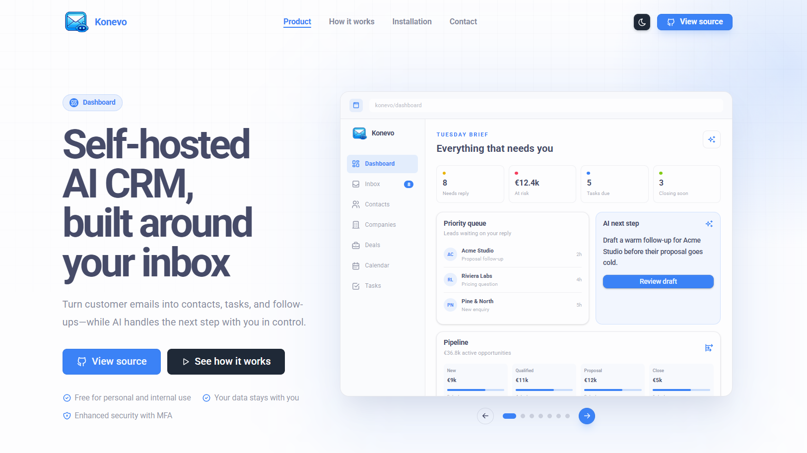

<h1 align="center">
   Konevo
</h1>

<p align="center">
  <strong>Your inbox, organized into meaningful relationships.</strong>
</p>

<p align="center">
  A self-hosted, AI-first CRM that turns email into contacts, tasks, and follow-ups&mdash;while you stay in control.
</p>

<p align="center">
  <a href="#installation">Installation</a> &middot;
  <a href="#quick-start">Source development</a> &middot;
  <a href="docs/README.md">Documentation</a> &middot;
  <a href="docs/SETUP.md">Deployment</a>
</p>

<p align="center">
  
</p>

Konevo is not a hosted service. You deploy it, control its infrastructure, and
bring your own Gmail OAuth credentials and OpenAI API key.

## Built for the work that happens after &ldquo;send&rdquo;

Konevo helps your team turn an overflowing inbox into clear, shared next steps.

- **Remember every relationship.** Keep people, companies, deals, tasks, and the context behind every conversation together in one workspace.
- **Work from the inbox you already use.** Sync Gmail, bring in email history, write replies with your signatures, and create calendar events without losing the thread.
- **Put AI to work&mdash;with you in control.** Let Konevo spot tasks and draft replies, then review every suggestion before it becomes action.
- **Never let a good conversation go cold.** Start with ready-made automations for unanswered emails, turning messages into tasks, and preparing AI-assisted replies.
- **Own your workflow and your data.** Run Konevo yourself, collaborate with your team, and rely on activity history, file uploads, review queues, and thoughtful follow-up safeguards.

## Documentation

Start here:

- [Documentation index](docs/README.md)
- [Setup and deployment](docs/SETUP.md)
- [Gmail integration](docs/GMAIL.md)
- [Automations](docs/AUTOMATIONS.md)
- [Security and operational hardening](docs/SECURITY.md)

The public product presentation is available at `/` after starting Konevo.

## Installation

For production, use the immutable GHCR release image and keep all application
settings and secrets on the server. Do not download individual Compose files
with `curl` and do not give GitHub a server SSH key. The complete, current guide is
[Release deployment](docs/RELEASE_DEPLOYMENT.md); it is the same workflow shown
on the product presentation at `/`.

You need a Linux server with Docker Engine and Docker Compose v2, a public
domain pointing to the server, and inbound TCP ports 80 and 443 open. Clone the
repository once, create `/opt/konevo/app/.env` from `.env.example`, and set
`APP_IMAGE=ghcr.io/filippauco/konevo:vX.Y.Z` there with an immutable published
release tag. Then start it with:

~~~shell
sudo docker compose --env-file /opt/konevo/app/.env \
  -f /opt/konevo/app/deploy/docker/compose.yaml up -d
~~~

The guide also covers
creating the first owner and the optional five-minute server-side update timer.

## Quick start

Requirements: Elixir 1.15+, Erlang/OTP, PostgreSQL, Node.js/npm, and ImageMagick.

```shell
cp .env.example .env
mix setup
mix phx.server
```

On PowerShell, use `Copy-Item .env.example .env`. Then create the first owner:

```shell
mix run -e "IO.inspect(Konevo.Release.create_owner())"
```

Open <http://localhost:4000>. Public registration is intentionally disabled.

## Self-hosting responsibilities

The operator of a Konevo instance is responsible for its users, data, backups,
hosting location, Gmail OAuth configuration, OpenAI API configuration, and
compliance obligations. Read the [setup](docs/SETUP.md),
[Gmail](docs/GMAIL.md), and [security](docs/SECURITY.md) guides before connecting
real data.

## License

Konevo is **source-available, not open source**.

- Personal and other noncommercial use: PolyForm Strict License 1.0.0
- Internal business use and private internal modifications: PolyForm Internal Use License 1.0.0

Redistribution, resale, sublicensing, white-labeling, paid third-party
installation, and hosted or managed service use require written permission.
Read [LICENSE](LICENSE), [commercial licensing](COMMERCIAL-LICENSING.md), and
[trademark terms](TRADEMARKS.md).

## Participate or get help

Feedback and bug reports are welcome through GitHub issues. Read
[CONTRIBUTING.md](CONTRIBUTING.md) before submitting a pull request. For licensing,
collaboration, or product questions, email [filip.pauco08@gmail.com](mailto:filip.pauco09@gmail.com).

Report security vulnerabilities privately as described in [SECURITY.md](SECURITY.md).
